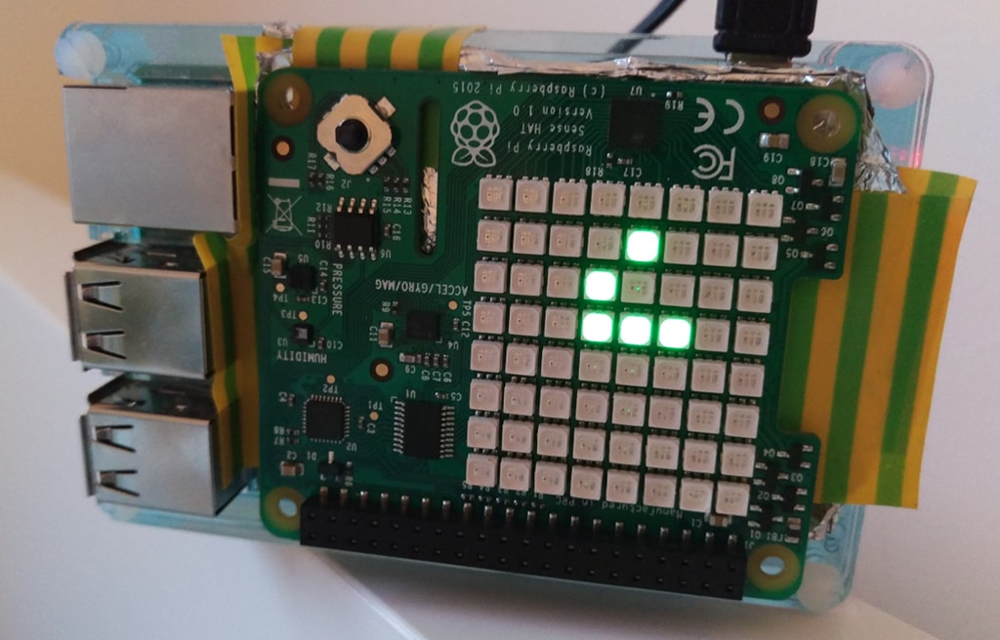

# Sense-of-Life

A simple project to play [Conway's Game of Life](https://en.wikipedia.org/wiki/Conway%27s_Game_of_Life)
on a Raspberry Pi [SenseHAT](https://www.raspberrypi.org/products/sense-hat/)'s
8x8 LCD matrix.

* The code randomly initializes the board, except if the `SEED` environment variable
  is found, because then it uses that to initialize (see code).
* The game is looped until the last two frames are the same (e.g. run out of cells,
  or have a static configuration), in which case the code restarts the simulation
  using the same seed if supplied, or random value
* Can press the SenseHAT joystick any time to do a restart (including new
  randomization if no seed is supplied)
* The initial setup fills the board with cells at 25% probability

This code gratefully reuses the Game of Life algorithm published in
[Pythonic Perambulations](https://jakevdp.github.io/blog/2013/08/07/conways-game-of-life/).

## License

Copyright 2017 Gergely Imreh <imrehg@gmail.com>

Licensed under the Apache License, Version 2.0 (the "License");
you may not use this file except in compliance with the License.
You may obtain a copy of the License at

    http://www.apache.org/licenses/LICENSE-2.0

Unless required by applicable law or agreed to in writing, software
distributed under the License is distributed on an "AS IS" BASIS,
WITHOUT WARRANTIES OR CONDITIONS OF ANY KIND, either express or implied.
See the License for the specific language governing permissions and
limitations under the License.
